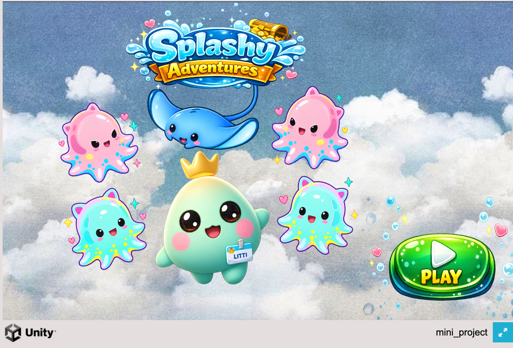

# 🎮 Splashy Adventures

A 2D survival game developed with **Unity and C#** as a guided learning project.

The project gave me hands-on experience with Unity's workflow and core gameplay programming concepts.

## 🎯 Gameplay

Survive as long as possible by avoiding falling hazards and using the dash mechanic at the right time.

### Key Features
- Player movement
- Dash mechanics
- Enemy spawning
- Collision detection
- Health and damage systems
- Progressive difficulty
- Rigidbody2D physics
- Animations
- Audio
- Particle effects
- Unity UI

## 🛠️ Built With

- **Unity**
- **C#**
- **Rigidbody2D**
- **Unity UI**

## 🎮 Play the Game

**[Play Splashy Adventures on itch.io](https://pavani-reddy.itch.io/splashy-adventures)**

## 📚 About the Project

This project was developed through guided learning and hands-on experimentation while learning Unity and C#. I am continuing to build on these concepts through new projects and gameplay programming practice.

---

🌌 **Where code meets imagination, a whole new world begins.**
